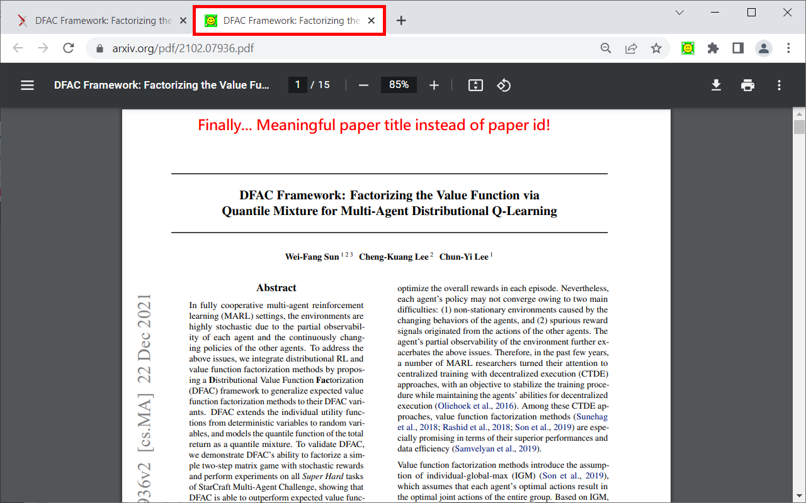
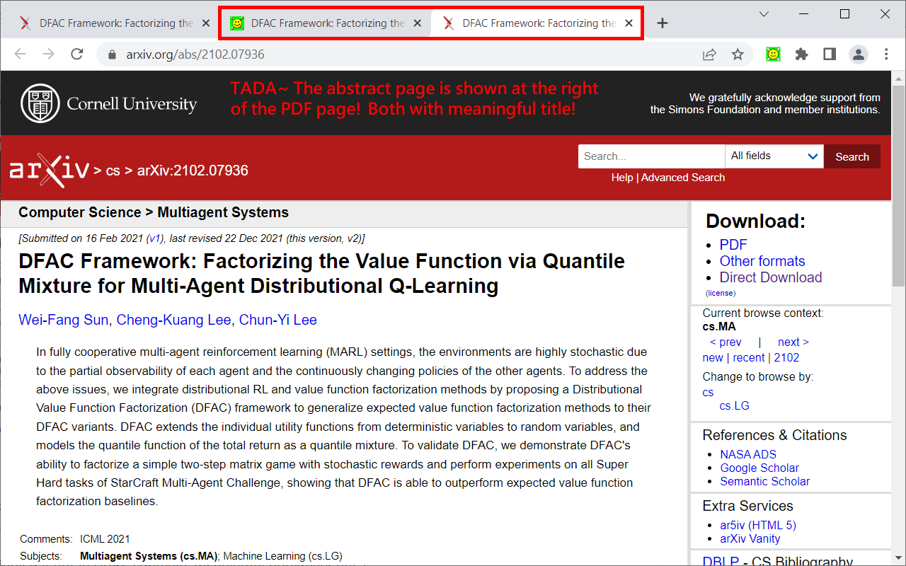
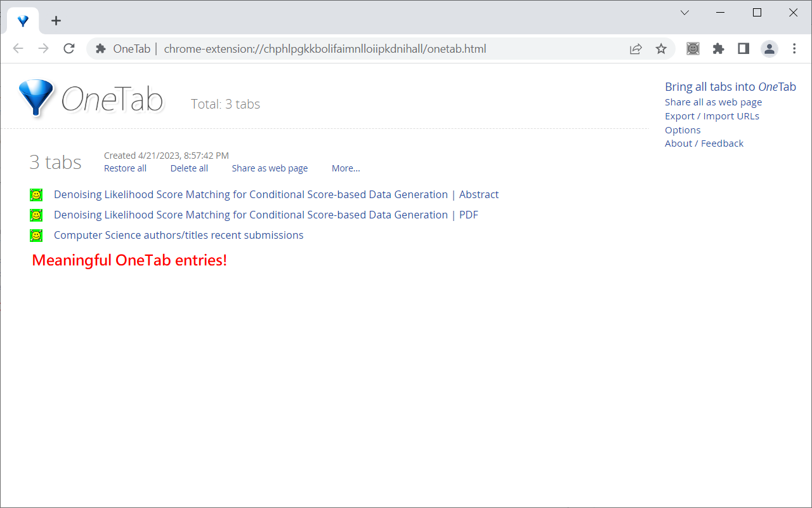

# arxiv-utils

[](https://chrome.google.com/webstore/detail/mediumship/mnhdpeipjhhkmlhlcljdjpgmilbmehij)
[](https://chrome.google.com/webstore/detail/mediumship/mnhdpeipjhhkmlhlcljdjpgmilbmehij)
[](https://chrome.google.com/webstore/detail/mediumship/mnhdpeipjhhkmlhlcljdjpgmilbmehij)

[](https://addons.mozilla.org/en-US/firefox/addon/arxiv-utils/)
[](https://addons.mozilla.org/en-US/firefox/addon/arxiv-utils/)
[](https://addons.mozilla.org/en-US/firefox/addon/arxiv-utils/)

[](https://microsoftedge.microsoft.com/addons/detail/arxivutils/ngjpcfjabahdoadnajbhnikbemhmemdg)
[](https://microsoftedge.microsoft.com/addons/detail/arxivutils/ngjpcfjabahdoadnajbhnikbemhmemdg)

[](https://www.producthunt.com/posts/arxiv-utilities?utm_source=badge-featured&utm_medium=badge&utm_souce=badge-arxiv-utilities)


If you are a researcher that reads a lot on ArXiv, you'll benefit a lot from this web extension.

- Renames the title of PDF page to the paper's title.
- Adds a button to navigate back to Abstract page.
- Download PDF with paper's title as filename.

## Download Links

Supports Chrome, Firefox, Edge, Firefox on Android. (Android version is not tested)

- [Chrome Web Store](https://chrome.google.com/webstore/detail/arxiv-utils/mnhdpeipjhhkmlhlcljdjpgmilbmehij)
- [Firefox Add-on](https://addons.mozilla.org/en-US/firefox/addon/arxiv-utils/)
- [Edge Add-on](https://microsoftedge.microsoft.com/addons/detail/arxivutils/ngjpcfjabahdoadnajbhnikbemhmemdg)

## Screenshots

The paper id in the title has been removed automatically!
A direct download link is added to download PDF with paper's title as the filename!

Finally... Meaningful paper title instead of paper id! (For Firefox, this is achieved through a custom PDF container.)

Difficult to get back to abstract page...
Click to get back to abstract page!

TADA~ The abstract page is shown at the right of the PDF page! Both with meaningful title!

The button is disabled if not in ArXiv's domain.
Meaningful bookmark titles.

Meaningful OneTab entries! (Google Chrome only)


## Problem Description

ArXiv is a really nice website for researchers, but I think it has 3 main shortages:

1. Unable to link to abstract page from PDF page if the PDF page is accessed directly.
2. No meaningful title for the PDF page, the abstract page have a redundant paper id as the prefix of the title. Bookmarking the PDF page is useless for later bookmark searches.
3. Downloading PDF requires a manual renaming afterwards.

This extension provides a solution to all of them!

## Solution Descriptions

For ArXiv PDF / abstract tabs:

- Renames the title to paper's title automatically in the background. (Originally is meaningless paper id, or start with paper id)
- Add a browser button to open its corresponding abstract / PDF page. (Originally is hard to get back to abstract page from PDF page)
- Add a direct download link on abstract page, click it to download the PDF with the title as filename. (Originally is paper id as filename)
- Better title even for bookmarks and the [OneTab](https://www.one-tab.com/) plugin!
- Firefox has [strict restrictions on PDF.js](https://bugzilla.mozilla.org/show_bug.cgi?id=1454760). So it doesn't work well with OneTab, the PDF renaming is achieved by intercepting requests and show the PDF in a container. The bookmark works well though.

## Chrome / Edge Documentation

### Permissions

- `tabs`: On button click, open a new tab and move it to the right of the old active tab.
- `activeTab`: Read active tab's title and modify it using the tab's url.
- `*://export.arxiv.org/*`: Query the title of the paper using the paper id retrieved in the tab's url.
- `*://arxiv.org/*`: This plugin works on ArXiv's abstract and PDF page.

### Methods

- `background` (`background.js`)

  Mainly describes the methods for button click. (Open new tab)

  **Compacted methods:**

  ```js
  // This background script is for adding the back to abstract button.
  var app = {};
  // All logs should start with this.
  app.name = "[arXiv-utils]";
  // Return the type parsed from the url. (Returns "PDF" or "Abstract")
  app.getType = function (url);
  // Return the id parsed from the url.
  app.getId = function (url, type);
  // Open the abstract / PDF page using the current URL.
  app.openAbstractTab = function (activeTabIdx, url, type);
  // Check if the URL is abstract or PDF page, returns true if the URL is either.
  app.checkURL = function (url);
  // Called when the url of a tab changes.
  app.updateBrowserActionState = function (tabId, changeInfo, tab);
  // Run this when the button clicked.
  app.run = function (tab) {
    if (!app.checkURL(tab.url)) {
      console.log(app.name, "Error: Not arXiv page.");
      return;
    }
    var type = app.getType(tab.url);
    app.openAbstractTab(tab.index, tab.url, type);
  }
  // Listen for any changes to the URL of any tab.
  chrome.tabs.onUpdated.addListener(app.updateBrowserActionState);
  // Extension button click to modify title.
  chrome.browserAction.onClicked.addListener(app.run);
  ```

- `content_scripts` (`content.js`)

  Mainly describes what will be run when page loaded. (Modify tab title)

  Runs at `document_end` (The DOM has finished loading, but resources such as scripts and images may still be loading.) for urls: `*://arxiv.org/*.pdf`, `*://arxiv.org/abs/*`.

  **Compacted methods:**

  ```js
  var app = {};
  // All logs should start with this.
  app.name = "[arXiv-utils]";
  // These 4 below are For checking if tab title has been updated.
  app.id = undefined;
  app.type = undefined;
  app.title = undefined;
  app.newTitle = undefined;
  // These 2 below are for inserting download link.
  app.firstAuthor = undefined;
  app.publishedYear = undefined;
  // Return the type parsed from the url. (Returns "PDF" or "Abstract")
  app.getType = function (url);
  // Return the id parsed from the url.
  app.getId = function (url, type);
  // Get the title asynchronously, call the callbacks with the id, the type, and the queried title as argument when request done (`callback(id, type, title, newTitle)`).
  // Updates `app`'s 4 variables: `title`, `type`, `id`, `newTitle` before callback.
  app.getTitleAsync = function (id, type, callback, callback2);
  // Insert the title into the active tab.
  // After the insertion, the title might be overwritten after the PDF has been loaded.
  app.insertTitle = function (id, type, title, newTitle) {
  // Add a direct download link if is abstract page.
  app.addDownloadLink = function (id, type, title, newTitle);
  // Run this after the page has finish loading.
  app.run = function () {
    var url = location.href;
    var type = app.getType(url);
    var id = app.getId(url, type);
    if (id === null) {
      console.log(app.name, "Error: Not in ArXiv pdf or abstract page, aborted.");
      return;
    }
    app.getTitleAsync(id, type, app.insertTitle, app.addDownloadLink);
  }
  // Change the title again if it has been overwritten (PDF page only).
  app.onMessage = function (tab, sender, sendResponse);
  // Listen for background script's message, since the title might be changed when PDF is loaded.
  chrome.runtime.onMessage.addListener(app.onMessage);
  ```

- `browser_action`
  - When clicked on Abstract page: Open PDF page in new tab.
  - When clicked on PDF page: Open Abstract page in new tab.
  - Disabled outside ArXiv's domain.

## Firefox Documentation

### Permissions

- `tabs`: On button click, open a new tab and move it to the right of the old active tab.
- `activeTab`: Read active tab's title and modify it using the tab's url.
- `webRequest`: Intercept ArXiv PDF request.
- `webRequestBlocking`: Redirect the ArXiv PDF page to custom PDF container page.
- `bookmarks`: When create a new bookmark of the PDF container page, bookmark the actual ArXiv PDF url instead.
- `*://export.arxiv.org/*`: Query the title of the paper using the paper id retrieved in the tab's url.
- `*://arxiv.org/*`: This plugin works on ArXiv's abstract and PDF page.
- `"content_security_policy": "script-src 'self'; object-src 'self' https://arxiv.org https://export.arxiv.org;"`: For embedding PDF in container.
- `"web_accessible_resources": [ "pdfviewer.html" ]`: To redirect from HTTPS to extension custom page requires them to be visible.

### Methods

- `background` (`background.js`)

  Mainly describes the methods for button click. (Open new tab)

  **Compacted methods:**

  ```js
  var app = {};
  // All logs should start with this.
  app.name = "[arXiv-utils]";
  // For our PDF container.
  app.pdfviewer = "pdfviewer.html";
  app.pdfviewerTarget = "pdfviewer.html?target=";
  // The match pattern for the URLs to redirect
  // Note: https://arxiv.org/pdf/<id> is the direct link, then the url is renamed to https://arxiv.org/pdf/<id>.pdf
  //       we capture only the last url (the one that ends with '.pdf').
  // Adding some extra parameter such as https://arxiv.org/pdf/<id>.pdf?download can bypass this capture.
  app.redirectPatterns = ["*://arxiv.org/*.pdf", "*://export.arxiv.org/*.pdf",
                          "*://arxiv.org/pdf/*", "*://export.arxiv.org/pdf/*"];
  // Return the type parsed from the url. (Returns "PDF" or "Abstract")
  app.getType = function (url);
  // Return the id parsed from the url.
  app.getId = function (url, type);
  // Open the abstract / PDF page using the current URL.
  app.openAbstractTab = function (activeTabIdx, url, type);
  // Check if the URL is abstract or PDF page, returns true if the URL is either.
  app.checkURL = function (url);
  // Called when the url of a tab changes.
  app.updateBrowserActionState = function (tabId, changeInfo, tab);
  // Redirect to custom PDF page.
  app.redirect = function (requestDetails);
  // If the custom PDF page is bookmarked, bookmark the original PDF link instead.
  app.modifyBookmark = function (id, bookmarkInfo);
  // Run this when the button clicked.
  app.run = function (tab) {
    if (!app.checkURL(tab.url)) {
      console.log(app.name, "Error: Not arXiv page.");
      return;
    }
    var type = app.getType(tab.url);
    app.openAbstractTab(tab.index, tab.url, type);
  }
  // Listen for any changes to the URL of any tab.
  chrome.tabs.onUpdated.addListener(app.updateBrowserActionState);
  // Extension button click to modify title.
  chrome.browserAction.onClicked.addListener(app.run);
  // Redirect the PDF page to custom PDF container page.
  chrome.webRequest.onBeforeRequest.addListener(
    app.redirect,
    { urls: app.redirectPatterns },
    ["blocking"]
  );
  // Capture bookmarking custom PDF page.
  chrome.bookmarks.onCreated.addListener(app.modifyBookmark);
  ```

- `content_scripts` (`content.js`)

  Mainly describes what will be run when page loaded. (Modify tab title)

  Runs at `document_end` (The DOM has finished loading, but resources such as scripts and images may still be loading.) for urls: `*://arxiv.org/abs/*`.

  **Compacted methods:**

  ```js
  var app = {};
  // All logs should start with this.
  app.name = "[arXiv-utils]";
  // These 2 below are for inserting download link.
  app.firstAuthor = undefined;
  app.publishedYear = undefined;
  // Return the id parsed from the url.
  app.getId = function (url);
  // Get the title asynchronously, call the callbacks with the id, the type, and the queried title as argument when request done (`callback(id, type, title, newTitle)`).
  app.getTitleAsync = function (id, type, callback, callback2);
  // Insert the title into the active tab.
  app.insertTitle = function (id, title, newTitle);
  // Add a direct download link if is abstract page.
  app.addDownloadLink = function (id, title, newTitle);
  // Run this after the page has finish loading.
  app.run = function () {
    var url = location.href;
    var id = app.getId(url);
    if (id === null) {
      console.log(app.name, "Error: Not in ArXiv pdf or abstract page, aborted.");
      return;
    }
    app.getTitleAsync(id, "Abstract", app.insertTitle, app.addDownloadLink);
  }
  ```

- `browser_action`
  - When clicked on Abstract page: Open PDF page in new tab.
  - When clicked on PDF page: Open Abstract page in new tab.
  - Disabled outside ArXiv's domain.
- PDF container (`pdfviewer.html`, `pdfviewer.js`)
  Embed the target pdf (retrieved from url parameter) in the page.
  ```js
  var app = {};
  app.name = "[arXiv-utils]";
  // Return the id parsed from the url.
  app.getId = function (url);
  // Get the title asynchronously, call the callback with title as argument when request done.
  app.getTitleAsync = function (id, type, callback);
  // Insert the title into the active tab.
  app.insertTitle = function (title);
  // Extract the pdf url from 'pdfviewer.html?target=<pdfURL>'.
  app.extractURL = function ();
  // Inject embedded PDF.
  app.injectPDF = function (url);
  // Run this once.
  app.run = function () {
    var pdfURL = app.extractURL();
    var id = app.getId(pdfURL);
    app.getTitleAsync(id, "PDF", app.insertTitle);
    app.injectPDF(pdfURL);
  }
  ```

## Test Flow (Manually)

Let's use this paper: [Exploration via Flow-Based Intrinsic Rewards](https://arxiv.org/abs/1905.10071) for example.

For Chrome, the Inspector can be opened to see the logs. Make sure there are no errors after performing the actions below:

For Firefox, the Inspector and Add-on Debugger can be opened to see the logs. Other installed add-ons may pollute the logs.

- The extension button should be disabled outside ArXiv's domain.
- Open [abstract page](https://arxiv.org/abs/1905.10071), the title should be changed to `Exploration via Flow-Based Intrinsic Rewards | Abstract` instead of `[1905.10071] Exploration via Flow-Based Intrinsic Rewards`.
- Click the extension button, the new [PDF page](https://arxiv.org/pdf/1905.10071.pdf) should be opened at the right of the abstract page.
- The opened [PDF page](https://arxiv.org/pdf/1905.10071.pdf) should have title `Exploration via Flow-Based Intrinsic Rewards | PDF` instead of `1905.10071.pdf`.
- **Firefox Only** The PDF tab should have a long URL, which mean that the PDF are in the extension container.
- Click the extension button, the new [abstract page](https://arxiv.org/abs/1905.10071) should be opened at the right of the PDF page.
- Try to bookmark the abstract tab, the title should be the new title.
- Try to bookmark the PDF tab, the title should be the new title.
- **Firefox Only** Check the PDF bookmark's URL, it should be the original ArXiv PDF link.
- **Chrome Only** If [OneTab](https://www.one-tab.com/) is installed, click its extension button, the list should show the updated titles of both abstract and PDF page.

- Test PDF urls:
  - PDF link with special format
    https://arxiv.org/ftp/arxiv/papers/1110/1110.2832.pdf
  - Export Arxiv site
    https://export.arxiv.org/pdf/2003.13678.pdf
  - Doesn't end with `.pdf`
    https://arxiv.org/pdf/2003.13678
  - Ends with slash
    https://arxiv.org/pdf/2003.13678/
  - **Chrome Only** PDF title renaming by original file name
    https://arxiv.org/pdf/1906.07413.pdf
    https://arxiv.org/pdf/2003.01367.pdf
  - **Firefox Only** PDF using HTTP
    http://arxiv.org/pdf/2003.13678.pdf
- Test PDF download (`Download PDF (arxiv-utils)`) in abstract. In firefox, only mouse left-click works, middle-click open up the original PDF page in a new tab.

## Related Extensions

- [arXiv-title-fixer](https://github.com/musically-ut/arXiv-title-fixer) that works well on Google Chrome.
  This requires a button click to change the pdf title, but will be considered less intrusive than running in the background.
- [arxiv-url](https://github.com/weakish/arxiv-url)
  This claims to add a back button, but I can't get it working.

## Privacy Policy

We do not gather your personal data. If in doubt, please refer to the source code.
